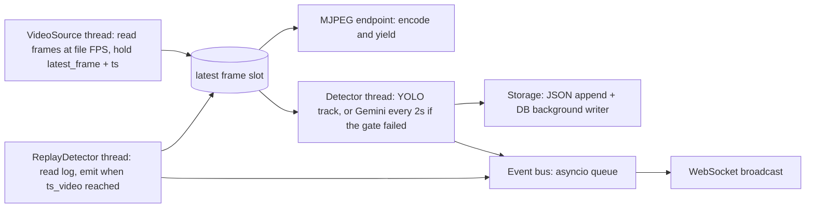

# Road English Coach — Plan Review and Task Breakdown

Big Red Hacks 2026. Under 24 hours. Two people. Goal: a working, demoable product.

## Decisions locked (2026-10-03, updated)

Build the basic demo first. That demo is full-frame Gemini, not local YOLO.

- **Now.** OpenCV plays the video on the laptop. About every 2 seconds one frame goes to Gemini. Gemini returns the catalog id, the text, and a box. The box is drawn on a frozen thumbnail in the sign log. The catalog supplies the meaning. Safety cues use the catalog `cue_text`. This keeps the demo small and uses the free Gemini key (a few calls per drive, not one per frame).
- **Later, once that demo works.** A US-trained YOLO model finds and tracks signs and draws live boxes. Gemini then reads one crop per tracked sign. Weights: Roboflow US Road Signs or the LISA fine-tune `cvtechniques/TrafficSignDetection`. Not stock `yolov8n.pt`. Do not install PyTorch until the Gemini demo is running.
- Gemini still grades practice answers. Grok stays a spare key. Tiger Data stays optional; the JSON log is the demo record.

Everything else in this file stands: catalog, cues, Park practice, keyword fallback, JSON log plus hypertables, replay, Photon only after docs.

---

## Part 1: Critical review of the spec

Things that will not work as written, are missing, or are riskier than they look. Each has a fix.

### Blocking / do first

1. **The `brh` conda env does not exist on this machine.** `conda env list` shows only `base`, `HW00`, `cs4670_env`. The repo also has no `.gitignore` and no `.env`. Fix: task T0.1/T0.2 create these before anything else. Pin `requirements.txt` so the teammate's machine matches.

2. **No dashcam footage exists yet, and footage quality decides whether detection works at all.** Gemini and YOLO both need signs that are legible at ~640 px wide. Fix: today, record a 2–3 minute phone video on a local road with several clear US signs (stop, speed limit, yield, one-way, no-turn, exit), or pick a YouTube US dashcam clip. Cut a 60–90 s demo clip. Then build the catalog around the signs that actually appear in it, not the other way around.

3. **Photon has no Python SDK.** The current SDK is TypeScript (`spectrum-ts`, low-level `@photon-ai/advanced-imessage`). Outbound send is REST-able, but inbound replies arrive either over a gRPC stream (Node/Bun only) or a webhook that **must be a public HTTPS URL** (Photon refuses `localhost`). Fix: do not wire Python to Photon directly. Build a tiny Node sidecar in `photon_bridge/` that uses the TS SDK, forwards inbound messages to FastAPI (`POST /api/practice/reply`), and exposes `POST /send` for FastAPI to call. Needs Node installed, Photon project credentials, and a provisioned iMessage line. Keep it Tier 2 stretch and build the Python `PracticeChannel` interface first so the UI and iMessage share one session engine.

### Will not work as described

4. **Live bounding boxes from full-frame Gemini will visibly lag the video.** A Gemini vision call takes 1–4 s; by the time a box comes back, the sign has moved or left the frame. This is why the preferred path takes boxes from YOLO, which keeps up with the video, and asks Gemini only what the crop says. The lag fix still applies to the fallback path: tag each sampled frame with its video timestamp, draw the box on a frozen thumbnail in the sign log, and overlay on the live stream only if the result arrives within ~1.5 s of the sample. Set `thinking_config.thinking_budget=0` on every Gemini vision call. If the fallback asks Gemini for boxes, it returns `box_2d` as `[ymin, xmin, ymax, xmax]` normalized to 0–1000; convert that to pixels of the original frame.

5. **One Gemini call per second will blow a free-tier key.** 1 fps is 60 requests per minute. Free-tier Flash is on the order of 10–15 RPM. The preferred path makes one call per tracked sign, which a 90-second demo can survive. The fallback path samples every 2 seconds and skips a frame that is nearly identical to the last one (cheap mean-abs-diff). Do not build the 1 fps full-frame loop.

6. **The video loop and Gemini calls must be decoupled or the stream stutters.** If the frame-reading loop awaits detection, the MJPEG stream freezes for seconds. Fix: `VideoSource` thread reads frames paced to the file's FPS and keeps a `latest_frame + ts` slot; a separate detector thread samples that slot every N seconds and drops frames when busy. MJPEG endpoint reads the slot. Three independent loops.

7. **Browser audio will not play without a user gesture.** Chrome blocks autoplay, so the first safety cue silently fails. Fix: a "Start drive" button on the UI that plays a silent clip to unlock audio before the stream starts. Same button starts the pipeline, which makes the demo flow natural.

8. **Replay mode as specified only covers detection; the practice session still needs the network.** Questions use ElevenLabs TTS, grading uses Gemini. Fix: pre-generate the practice question audio too (questions live in the catalog, so this is free) and add a keyword-match grading fallback (catalog entry lists `answer_keywords`) used when Gemini fails or `OFFLINE=1`. Tiger Data writes must be fire-and-forget in a background thread with try/except, so a Wi-Fi drop never raises in the request path.

9. **TimescaleDB hypertable gotcha.** `create_hypertable` fails if the table has a primary key or unique index that does not include the time column. Do not use `id SERIAL PRIMARY KEY`. Use `PRIMARY KEY (ts, id)` or no PK. Tiger Data connection strings need `sslmode=require`. Tiger Data is rebranded Timescale; `psycopg2` works as-is.

10. **Browser speech recognition is Chrome-only in practice.** Web Speech API (`webkitSpeechRecognition`) works on Chrome; Safari is partial, Firefox none. Fix: demo in Chrome; always keep the typed-answer box visible as fallback.

11. **Webcam on macOS needs a permission prompt.** The first `cv2.VideoCapture(0)` from a terminal triggers a Camera permission dialog for Terminal/Cursor; if denied once, it silently returns black frames. Test the webcam path early (T1.2), not at demo time.

12. **The wrong YOLO weights will miss US signs.** Ultralytics does not ship a traffic-sign model. Stock COCO `yolov8n.pt` has one sign class, stop sign. GTSDB and GTSRB weights are German signs. US weights do exist: the LISA dataset, the Roboflow US Road Signs YOLOv8 export, and the LISA YOLOv11 fine-tune `cvtechniques/TrafficSignDetection`. A coarse model (regulatory / warning / stop) is enough, because Gemini reads the crop. Fix: T0.5 runs those weights on our clip before T1.4. Use `model.track(persist=True)` so tracking is free. If the boxes miss, Tier 1 is the Gemini fallback and YOLO stays behind `DETECTOR=yolo` for a later attempt. Do not spend Tier 1 building both detectors.

### Missing from the spec

13. **No state model.** Define one in-memory `AppState` singleton: `mode` (driving/parked), `drive_id`, `detections: list[Detection]`, `practice: PracticeSession | None`, `detector_kind`. Every endpoint reads/writes this. Good enough for a demo; avoids both of us inventing different state.

14. **No interface contracts between frontend and backend.** Two people working in parallel need the event JSON, API endpoints, and catalog schema fixed before coding. They are defined in Part 2 below. Agree on them first; then neither person blocks the other.

15. **How Gemini is prevented from inventing meanings.** Spec says Gemini identifies but never defines. Enforce it mechanically: the prompt includes the catalog list (`id` + `sign_text` only, no meanings), the response schema restricts `sign_id` to catalog ids or `"unknown"`, and the UI only ever shows `meaning` from the catalog JSON. Unknown signs get logged with Gemini's `sign_text` and a grey "not in catalog" chip; they never get a meaning.

16. **Cue text vs. meaning.** Safety cues must be short (3–6 words: "Stop ahead.", "Lane ends, merge left."). The catalog needs a separate `cue_text` field from `meaning`. Spanish explanation is shown only in parked mode.

17. **Scope and timing.** Tier 1 as written is 8–10 person-hours of focused work plus integration. Suggest a hard "demo-ready checkpoint" once video + detection + cues + sign log + replay work (end of T1.8), before building the practice session. If the night goes badly, that checkpoint is already a complete demo. Build replay alongside the live detector (same interface, different implementation), not afterward.

18. **Deferred cues (Tier 2.3) needs a flush point.** Otherwise deferred cues are just dropped. Flush at Park ("On this drive you also passed: ...") or when no safety-critical cue has fired for N seconds.

### Things we need from you (the humans)

- API keys in `.env`: `GEMINI_API_KEY`, `ELEVENLABS_API_KEY`, `ELEVENLABS_VOICE_ID`, `TIGER_DATABASE_URL`. A free Gemini key is fine on the preferred path (one call per sign). It is not fine for full-frame detection at 1 fps.
- US sign weights at `data/weights/us_signs.pt` (gitignored). Roboflow US Road Signs YOLOv8 export, or `cvtechniques/TrafficSignDetection`. Not `yolov8n.pt`.
- Dashcam footage (see item 2). Drop at `data/drive.mp4`.
- Chrome installed on the demo laptop.
- For Tier 2.2: Photon project ID/secret, a provisioned iMessage line, your phone number as the test recipient, Node 20+ installed, and the docs link (`photon.codes/docs`). Nothing Photon-related gets written until these exist.
- A human pass over `data/sign_catalog.json` against the MUTCD before the demo. Entries stay `"verified": false` until then.

---

## Part 2: Contracts (agree before splitting work)

These are the only things that cross the person-A / person-B boundary. Lock them in the first 30 minutes.

### Catalog entry (`data/sign_catalog.json`)

```json
{
  "id": "stop",
  "sign_text": "STOP",
  "meaning": "Come to a complete stop. Proceed only when safe.",
  "meaning_es": "Deténgase por completo. Continúe solo cuando sea seguro.",
  "cue_text": "Stop ahead.",
  "safety_critical": true,
  "questions": [
    { "q": "You passed this sign. What must you do?", "answer_keywords": ["stop", "complete stop"] }
  ],
  "verified": false
}
```

Target 12–18 entries chosen to match the footage. Candidates: stop, yield, speed_limit_55, speed_limit_35, do_not_enter, wrong_way, one_way, no_left_turn, no_u_turn, lane_ends_merge_left, road_work_ahead, railroad_crossing, weigh_station, truck_route, low_clearance, exit_only, no_trucks, school_zone.

### `Detection` (Python dataclass, also the JSON log row)

```json
{
  "drive_id": "2026-10-03T19-02-11",
  "ts_video": 12.4,
  "ts_wall": "2026-10-03T19:02:23.511Z",
  "sign_id": "stop",
  "sign_text": "STOP",
  "safety_critical": true,
  "speak_now": true,
  "box": [x1, y1, x2, y2],
  "confidence": 0.92,
  "source": "yolo" | "gemini" | "replay",
  "thumb_path": "data/thumbs/<drive_id>/<n>.jpg"
}
```

### WebSocket events (`/ws`, server to client, JSON)

- `{"type":"state","mode":"driving"|"parked","detector":"gemini"|"yolo"|"replay","drive_id":"..."}`
- `{"type":"detection", ...Detection fields..., "meaning":"...", "thumb_url":"/thumbs/..."}`
- `{"type":"cue","sign_id":"stop","audio_url":"/audio/stop_cue.mp3","text":"Stop ahead."}`
- `{"type":"deferred_cues","items":[...]}` (Tier 2.3)
- `{"type":"practice_question","index":1,"total":5,"sign_id":"stop","question":"...","audio_url":"/audio/stop_q1.mp3","thumb_url":"..."}`
- `{"type":"practice_result","sign_id":"stop","grade":"correct"|"partial"|"incorrect","feedback":"...","meaning":"...","meaning_es":"..."}`
- `{"type":"practice_done","summary":{"correct":3,"partial":1,"incorrect":1}}`

### HTTP endpoints

- `GET /` static UI; `GET /stream.mjpg` MJPEG; `GET /audio/*`, `GET /thumbs/*` static
- `POST /api/drive/start` body `{"source":"file"|"webcam","detector":"gemini"|"yolo"|"replay"}`
- `POST /api/park` → starts practice, returns first question
- `POST /api/practice/answer` body `{"text":"..."}` → returns `practice_result`, then next `practice_question` or `practice_done`
- `POST /api/practice/reply` (Tier 2, from Photon bridge) body `{"from":"+1...","text":"..."}`
- `POST /api/resume` → back to driving
- `GET /api/state` → current `AppState` (for page reload)

### Environment variables (`.env.example`)

```
GEMINI_API_KEY=
GEMINI_MODEL=gemini-2.5-flash
SIGN_READER=gemini
ELEVENLABS_API_KEY=
ELEVENLABS_VOICE_ID=
ELEVENLABS_MODEL=eleven_flash_v2_5
TIGER_DATABASE_URL=
VIDEO_PATH=data/drive.mp4
YOLO_WEIGHTS=data/weights/us_signs.pt
YOLO_MIN_BOX_PX=48
DETECTOR=yolo
DETECT_INTERVAL_S=2.0
DEDUP_WINDOW_S=15
DEFER_CUES=0
OFFLINE=0
PHOTON_BRIDGE_URL=http://localhost:3001
PHOTON_PROJECT_ID=
PHOTON_PROJECT_SECRET=
PHOTON_TEST_RECIPIENT=
# Spare only. Do not build a client unless Gemini returns 429.
# XAI_API_KEY=
# XAI_MODEL=grok-4.6
# XAI_BASE_URL=https://api.x.ai/v1
```

`DETECTOR=gemini` is the demo. Switch to `yolo` only after the basic demo works and a US weights file has been tested. `SIGN_READER` stays `gemini`.

### Threading model



---

## Part 3: Tasks, Tiers 0–2

Legend: **Model** = `small` (mechanical, well-specified) or `strong` (SDK correctness, concurrency, or judgment). **Lane** = A (pipeline/backend) or B (data/frontend/practice). Tasks in the same lane are sequential; tasks in different lanes run in parallel.

### Tier 0: setup and smoke tests

**T0.1 Repo scaffold** — Lane A — Model: small
- Files: `.gitignore` (`.env`, `data/*.mp4`, `data/*.mov`, `data/thumbs/`, `data/audio/*.mp3`, `__pycache__`, `*.pt`), `.env.example` (as above), `backend/requirements.txt` (pin: fastapi, uvicorn[standard], opencv-python, ultralytics, google-genai, elevenlabs, python-dotenv, psycopg2-binary, httpx, websockets), `backend/__init__.py`, `backend/config.py` (loads `.env`, exposes typed settings, fails loudly on missing required keys), empty `frontend/`, `data/`, `scripts/`, `README.md` skeleton.
- Done: `git status` clean except intended files; `python -c "from backend.config import settings"` runs.
- Depends on: nothing.

**T0.2 Create the conda env on both machines** — Lane A + human — Model: small
- Files: none (documents the command in README).
- Done: `conda create -n brh python=3.11 && conda activate brh && pip install -r backend/requirements.txt` succeeds on both laptops; `python -c "import cv2, ultralytics, google.genai, elevenlabs, psycopg2"` passes.
- Depends on: T0.1.

**T0.3 Smoke test script** — Lane A — Model: strong (three SDKs; verify current APIs against docs, do not guess)
- Files: `scripts/smoke_test.py`.
- Done: one minimal call each, each wrapped in try/except, prints `PASS`/`FAIL` with the error. Gemini: `client.models.generate_content` with `response_mime_type="application/json"` returning `{"ok": true}`. ElevenLabs: `client.text_to_speech.convert(voice_id, text="test", model_id=...)` written to `/tmp/el_test.mp3`, size > 0. Tiger Data: `psycopg2.connect(url)` then `SELECT now()` and `SELECT extversion FROM pg_extension WHERE extname='timescaledb'`. Exit code non-zero if any fail. **Stop and report results before Tier 1.**
- Depends on: T0.1, T0.2, keys in `.env`.

**T0.4 Footage and catalog draft** — Lane B + human — Model: small for the JSON; human for footage
- Files: `data/drive.mp4` (gitignored), `data/sign_catalog.json`, `scripts/validate_catalog.py` (checks required fields, unique ids, every entry `verified: false`).
- Done: a 60–90 s clip with 6+ legible signs sits at `data/drive.mp4`; catalog has 12–18 entries matching the contract schema and the footage; validator passes.
- Depends on: nothing. Fully parallel with T0.1–T0.3.

**T0.5 YOLO gate** — Lane A — Model: strong (the verdict decides Tier 1)
- Files: `scripts/eval_yolo.py`, `data/weights/us_signs.pt` (gitignored).
- Done: the script opens `data/drive.mp4`, runs `model.track(..., persist=True)` with `YOLO_WEIGHTS`, and prints each box with its class, confidence, and timestamp. A human watches enough of the clip to answer one question: do the boxes sit on the signs we care about? Print `PASS` or `FAIL` and stop. `PASS` means T1.4 builds `YoloDetector`. `FAIL` means T1.4 builds the full-frame Gemini fallback. Do not start T1.4 before this verdict.
- Depends on: T0.2, T0.4, weights on disk.

### Tier 1: core product

**T1.1 Catalog module** — Lane B — Model: small
- Files: `backend/catalog.py`.
- Done: `load_catalog()`, `get(sign_id)`, `ids()`, `prompt_list()` (returns `id: sign_text` lines, no meanings), `is_critical(sign_id)`. Unit-tested by a quick `/tmp` script.
- Depends on: T0.4.

**T1.2 Video source and MJPEG stream** — Lane A — Model: strong (threading, pacing, macOS webcam)
- Files: `backend/video.py`, `backend/main.py` (app, `/stream.mjpg`, static mount), `frontend/index.html` (placeholder ``).
- Done: `VideoSource(path_or_index)` thread reads frames paced to the file's FPS (sleep to real time, loop at end), exposes `latest()` returning `(frame, ts_video)`; webcam works via `cv2.CAP_AVFOUNDATION` after the macOS permission prompt; the browser shows smooth video at ~25 fps with JPEG quality 70; CPU stays reasonable. Overlay boxes are drawn from a shared `overlay` list with expiry (used by T1.4).
- Depends on: T0.1, T0.4 (footage).

**T1.3 Gemini sign reader** — Lane A — Model: strong (SDK and schema correctness)
- Files: `backend/gemini_client.py`, `scripts/test_reader.py` (run on a still crop).
- Done: `read_crop(crop_bgr, catalog) -> RawDetection | None` sends one JPEG of a single sign plus the catalog id list. Response schema is `{sign_id, sign_text, confidence}` with `sign_id` restricted to catalog ids or `"unknown"`. No box field. `thinking_budget=0`. Model name from `GEMINI_MODEL`. Timeout 8 s. Returns `None` on any error and logs it. `grade_answer(question, meaning, answer) -> {grade, feedback}` uses the same client (T1.9). Build `read_frame(frame_bgr, catalog) -> list[RawDetection]` only if T0.5 failed: same schema plus `box_2d` converted from 0–1000 `[ymin, xmin, ymax, xmax]` to original-frame pixels. Print measured latency for whichever function the gate needs.
- Depends on: T0.3, T0.5, T1.1.

**T1.4 Detector loop, dedup, event bus, WebSocket** — Lane A — Model: strong (concurrency)
- Files: `backend/detector.py`, `backend/events.py`, `backend/state.py` (`AppState`), `backend/main.py` (`/ws`, `/api/drive/start`, `/api/state`). If T0.5 passed, also `backend/yolo_detector.py`.
- Done: one detector, chosen by T0.5, behind `BaseDetector.start()` / `stop()`. Shared bus is an `asyncio.Queue` fed with `loop.call_soon_threadsafe`. `/ws` broadcasts. Detections dedup by `sign_id` within `DEDUP_WINDOW_S`, write a thumbnail to `data/thumbs/<drive_id>/`, append to `AppState.detections`, and push `detection` plus a `cue` when the sign is safety-critical.
  - **PASS.** `YoloDetector` calls `model.track(frame, persist=True, conf=0.4)` every few frames. The live overlay is the current track boxes, updated every frame, so they stay on the signs. When a track's box exceeds `YOLO_MIN_BOX_PX` (default 48) and that track id has not been read yet, crop it from the full-resolution frame and call `read_crop` once. `source` is `"yolo"`.
  - **FAIL.** `GeminiDetector` samples `VideoSource.latest()` every `DETECT_INTERVAL_S` (2 s), skips near-identical frames, calls `read_frame`, and draws boxes on the thumbnail. Overlay a box on the live stream only if the result is under ~1.5 s old. `source` is `"gemini"`.
- Depends on: T0.5, T1.2, T1.3.

**T1.5 Driving-mode UI** — Lane B — Model: small (contracts are fixed; polish needed)
- Files: `frontend/index.html`, `frontend/styles.css`, `frontend/app.js`.
- Done: dark, stage-readable layout: video with a `<canvas>` overlay for boxes, mode banner (DRIVING / PARKED), right-hand sign log (thumbnail, sign text, meaning, red chip if safety-critical, grey "unknown" chip), "Start drive" button (unlocks audio, calls `/api/drive/start`), "Park" button, source/detector selectors. WS client reconnects. Works against a mock WS feed before T1.4 lands (include `frontend/mock.js` that replays fake events, deleted before demo).
- Depends on: contracts only. Parallel with T1.2–T1.4.

**T1.6 Audio pre-generation and cue playback** — Lane B — Model: small
- Files: `scripts/generate_audio.py`, `frontend/app.js` (cue handler), `backend/main.py` (`/audio` static mount, already in T1.2).
- Done: script generates `data/audio/<id>_cue.mp3` from `cue_text` and `data/audio/<id>_q<n>.mp3` from each question, skips existing files, uses `ELEVENLABS_MODEL`/`ELEVENLABS_VOICE_ID`; frontend plays `audio_url` on `cue` events, never overlapping (queue of max 1, drop if busy). Also generates `data/audio/_unlock.mp3` (silence) for the autoplay unlock.
- Depends on: T0.3, T0.4.

**T1.7 Storage: JSON log and Tiger Data** — Lane B — Model: strong for the hypertable DDL and the non-blocking writer; small otherwise
- Files: `backend/storage.py`, `scripts/init_db.py` (DDL below), `data/detections_log.json`.
- Done: `init_db.py` creates `detections(ts timestamptz, drive_id text, sign_id text, sign_text text, safety_critical bool, ts_video double precision, source text, confidence real)` and `practice_answers(ts timestamptz, drive_id text, sign_id text, question text, answer text, grade text, channel text)`, both hypertables on `ts`, **no serial primary key**. `Storage.log_detection(d)` appends to `data/detections_log.json` synchronously (a JSON list keyed by `drive_id`, rewritten atomically) and enqueues a DB insert on a background thread that catches every exception and logs once per minute. `log_answer(...)` same pattern. Pulling the Wi-Fi mid-drive must not raise anywhere.
- Depends on: T0.3.

**T1.8 Replay detector** — Lane A — Model: small
- Files: `backend/replay.py`, `backend/main.py` (wire `detector=replay`).
- Done: `ReplayDetector` loads detections for a chosen `drive_id` (default: most recent) from `data/detections_log.json`, watches `VideoSource.latest()` ts, and emits each detection through the exact same bus path when `ts_video` is reached, including thumbnails and cues. Zero network calls. With `OFFLINE=1` set, the whole driving demo runs with Wi-Fi off. **Demo-ready checkpoint: at this point, rehearse once end to end.**
- Depends on: T1.4, T1.7.

**T1.9 Practice session backend** — Lane B — Model: strong (grading prompt, session logic, fallback)
- Files: `backend/practice.py`, `backend/main.py` (`/api/park`, `/api/practice/answer`, `/api/resume`).
- Done: `PracticeSession.from_detections(detections, catalog)` picks unique sign ids, safety-critical first, max 5, one question each, skips `unknown`. `/api/park` sets mode to parked, pauses the detector, builds the session, pushes `state` and the first `practice_question` event (with pre-generated `audio_url`). `/api/practice/answer` grades via `gemini_client.grade_answer` (prompt includes the catalog meaning as ground truth; returns correct/partial/incorrect plus one sentence of feedback), falls back to keyword match when Gemini errors or `OFFLINE=1`, stores via `Storage.log_answer`, pushes `practice_result` then next question or `practice_done`. `/api/resume` returns to driving. All session logic lives here so Tier 2 iMessage reuses it unchanged.
- Depends on: T1.1, T1.3 (`grade_answer`), T1.7.

**T1.10 Practice UI** — Lane B — Model: small
- Files: `frontend/app.js`, `frontend/index.html`, `frontend/styles.css`.
- Done: parked view replaces the sign log: big question card with the sign thumbnail, auto-plays question audio with a replay button, a mic button (`webkitSpeechRecognition`, `lang=en-US`, interim results shown) plus an always-visible text input, submit, graded result with colour, reveal of English meaning and Spanish explanation, progress `2 / 5`, summary screen with a "Back to driving" button. Degrades gracefully if speech recognition is unavailable (mic button hidden).
- Depends on: contracts; T1.9 for live testing.

**T1.11 Runtime TTS for feedback (optional)** — Lane B — Model: small
- Files: `backend/tts.py`, `backend/main.py` (`GET /api/tts?text=`), `frontend/app.js`.
- Done: cached ElevenLabs TTS for short feedback strings; frontend falls back to `speechSynthesis` when the endpoint fails. Skip if time is short; feedback can be text-only.
- Depends on: T0.3.

**T1.12 README, run script, full rehearsal** — Lane A — Model: small
- Files: `README.md`, `run.sh`.
- Done: README covers env creation, `.env`, `scripts/init_db.py`, `scripts/generate_audio.py`, `uvicorn backend.main:app --reload`, the three detector modes, the Chrome requirement, and the offline procedure. A full dry run (file → detection → cue → park → practice → resume → replay) passes twice. **Stop and summarize Tier 1.**
- Depends on: T1.1–T1.10.

### Tier 2: upgrades

**T2.1 Second YOLO attempt (only if T0.5 failed)** — Lane A — Model: strong
- Files: `backend/yolo_detector.py`, `data/weights/`.
- Done: one more US weights file, one hour, then stop. If it passes the same eyeball test as T0.5, swap `DETECTOR` to `yolo` using the `YoloDetector` described in T1.4. If it fails, leave the Gemini fallback as the demo. Skip this task entirely when T0.5 already passed.
- Depends on: T1.4, T1.12.

**T2.2 `PracticeChannel` abstraction** — Lane B — Model: small
- Files: `backend/channels.py`, `backend/practice.py` (uses the channel instead of pushing WS events directly).
- Done: `PracticeChannel` Protocol with `send_question(q)`, `send_result(r)`, `send_done(summary)`; `WebSocketChannel` implements it with the existing events; the session holds a list of channels so UI and iMessage both receive the same session. No behaviour change for the UI.
- Depends on: T1.9.

**T2.3 Photon iMessage delivery (blocked on docs and credentials)** — Lane B — Model: strong
- Files: `photon_bridge/package.json`, `photon_bridge/index.ts` (Node sidecar using the Photon TS SDK: subscribes to inbound messages and `POST`s them to `PHOTON_INBOUND_URL`; exposes `POST /send {to, text}`), `backend/photon_channel.py` (`PhotonChannel` calling the bridge with `httpx`), `backend/main.py` (`/api/practice/reply`), `.env.example`.
- Done: pressing Park sends the first question to `PHOTON_TEST_RECIPIENT`'s iMessage; replying grades the answer and sends the result plus the next question; the UI mirrors the same session live. Do not start until the human supplies Photon credentials, a provisioned line, the docs link, and Node 20+. Ask for the SDK docs before writing the sidecar; do not guess method names.
- Depends on: T2.2, external inputs.

**T2.4 Speak-or-wait cue policy** — Lane A — Model: small
- Files: `backend/cue_policy.py`, `backend/detector.py` (calls the policy), `frontend/app.js` (`deferred_cues` toast).
- Done: `CuePolicy.decide(detection) -> "speak" | "defer" | "silent"`. Safety-critical and `speak_now` → speak immediately. Safety-critical but not urgent → defer. Non-critical → silent. Deferred cues flush as one `deferred_cues` event at Park or after `DEFER_FLUSH_S` of quiet (default 20 s), rendered as a small "You also passed: ..." list. Enabled by `DEFER_CUES=1`; with `0` behaviour is exactly Tier 1.
- Depends on: T1.4, T1.6.

**T2.5 Stage polish and demo script** — Lane B — Model: small
- Files: `frontend/styles.css`, `frontend/index.html`, `DEMO.md`.
- Done: large type readable from the back of a room, a one-line explanation of the "out of service since June 2025" context on the start screen, consistent spacing/colours, a `DEMO.md` with the exact click sequence, which mode to run (replay first, live second), and the recovery plan if Wi-Fi dies. **Stop and summarize Tier 2.**
- Depends on: T1.12.

---

## Part 4: Parallel lanes

Two people, no file conflicts. Lane A owns `backend/video.py`, `detector.py`, `events.py`, `state.py`, `replay.py`, `gemini_client.py`, `yolo_detector.py`, `cue_policy.py`, `main.py` routes for drive/stream/ws. Lane B owns `data/`, `frontend/`, `backend/catalog.py`, `storage.py`, `practice.py`, `channels.py`, `photon_channel.py`, `tts.py`, `scripts/generate_audio.py`, `scripts/init_db.py`, and `main.py` routes for park/practice. Edits to `main.py` by both are fine if each only touches their own route block; keep the file small and import routers from `backend/routes_drive.py` and `backend/routes_practice.py` if it gets crowded.

| Step | Lane A (pipeline) | Lane B (data / UI / practice) |
| --- | --- | --- |
| Hour 0–1 | T0.1, T0.2, T0.3, then T0.5 once the clip and weights exist | T0.4 (footage + catalog), agree contracts |
| Hour 1–3 | T1.2 video + MJPEG | T1.1 catalog, T1.6 audio pre-gen, T1.5 driving UI against mock events |
| Hour 3–5 | T1.3 Gemini reader, T1.4 the one detector T0.5 picked | T1.7 storage + hypertables |
| Hour 5–6 | T1.8 replay, **checkpoint rehearsal** | T1.9 practice backend |
| Hour 6–8 | T1.12 README, help integrate practice | T1.10 practice UI, T1.11 optional TTS |
| Hour 8–9 | **Tier 1 summary, full rehearsal, sleep decision** | |
| Hour 9–11 | T2.4 speak-or-wait. T2.1 only if T0.5 failed | T2.2 channel abstraction, T2.5 polish |
| Hour 11–13 | help with Photon or the demo script | T2.3 Photon, only if credentials and docs are in hand |
| Hour 13+ | Tier 2 summary; Tier 3 only if everything above is solid | |

Dependencies that cross lanes (the only sync points):
- T0.5 needs the clip from T0.4 and the weights file.
- T1.3 needs T1.1 (`catalog.prompt_list()`) and the T0.5 verdict (crop reader vs full-frame reader). T1.9 needs T1.3 (`grade_answer`). Keep both functions tiny and agree on their signatures at hour 1.
- T1.4 needs the event schema that T1.5 is coding against. It is fixed in Part 2; do not change it without telling the other person.
- T1.8 reads the JSON written by T1.7. The `Detection` shape in Part 2 is the file format.

Rule of thumb when stuck for more than 20 minutes on any task: fall back to the simpler option listed in Part 1 and move on. The demo is replay mode plus a live webcam moment; everything else is a bonus.
